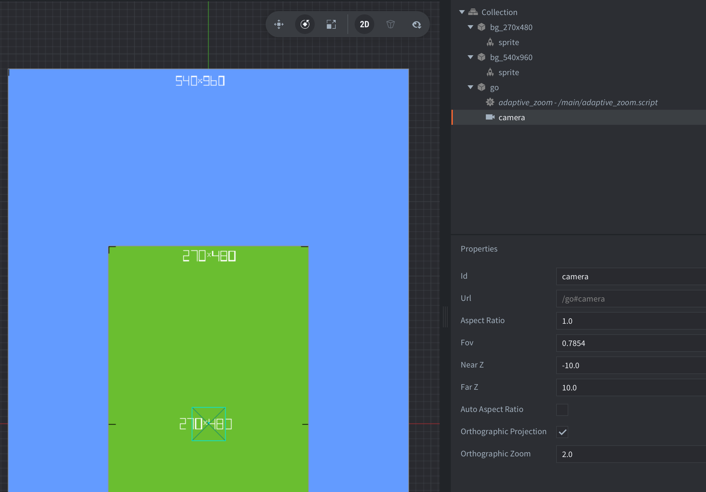
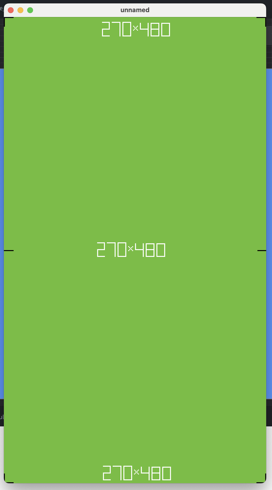
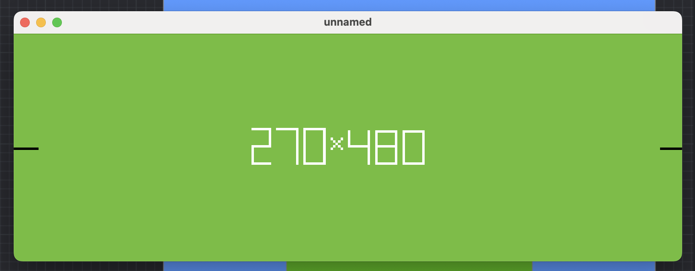
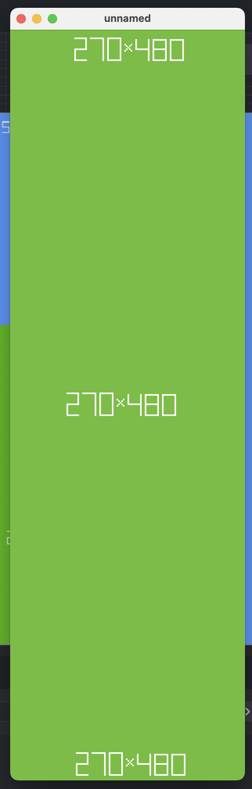
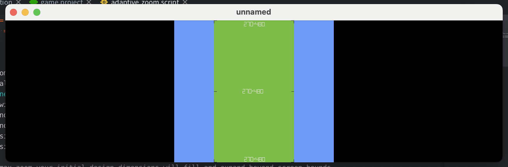
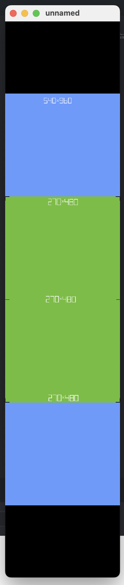

# Adaptive zoom

This sample project shows how to apply an adaptive zoom to your camera component to make content look good regardless of screen resolution. The sample project is based on a [Defold forum discussion](https://forum.defold.com/t/why-am-i-struggling-so-much-to-get-my-game-to-look-right-on-mobile/80503) about making a game look good on mobile.

The concept behind adaptive zoom is to calculate a camera zoom value when the dimensions of the display change from the "design resolution" in game.project.

In this project the display size is set to 540x960 pixels, and the camera should have a x2 zoom. The project is setup to have two background images, the blue is 540x960 and the green is 270x480 (ie half the size). There is an orthographic camera with a zoom of 2.



Attached to the camera there's also a script which detects screen resolution changes and calculates a new zoom for the camera:

```lua
local DISPLAY_WIDTH = sys.get_config_int("display.width")
local DISPLAY_HEIGHT = sys.get_config_int("display.height")

function init(self)
	local initial_zoom = go.get("#camera", "orthographic_zoom")
	local display_scale = window.get_display_scale()
	window.set_listener(function(self, event, data)
		if event == window.WINDOW_EVENT_RESIZED then
			local window_width = data.width
			local window_height = data.height
			local design_width = DISPLAY_WIDTH / initial_zoom
			local design_height = DISPLAY_HEIGHT / initial_zoom

			-- with max zoom your initial design dimensions will fill and expand beyond screen bounds
			local zoom = math.max(window_width / design_width, window_height / design_height) / display_scale

			-- with min zoom your initial design dimensions will shrink and be contained within screen bounds
			--local zoom = math.min(window_width / design_width, window_height / design_height) / display_scale
			
			go.set("#camera", "orthographic_zoom", zoom)
		end
	end)
end
```

This is what is seen when the project is started:



And this is how the camera behaves when the window is resized:





Notice in the code that there are two ways to calculate a zoom. The "max zoom" calculation produces the result seen above where the initial design dimensions will fill and expand beyond screen bounds.

```lua
local zoom = math.max(window_width / design_width, window_height / design_height) / display_scale
```

If the script is changed to use the "min zoom" calculation the initial design dimensions will shrink and be contained within screen bounds:





It is up to the developer to decide how the zoom should behave. Perhaps the zoom value should be round up or down to the nearest integer value to retain nicely sized pixels? Pr maybe there should be an upper or lower limit on the zoom calculation to deal with screen resolutions which vastly differ from the design resolution?